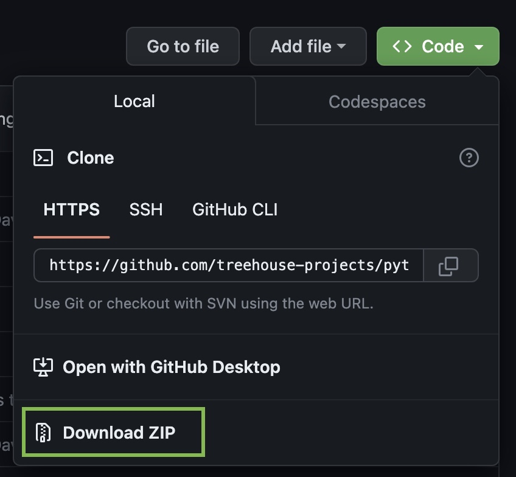
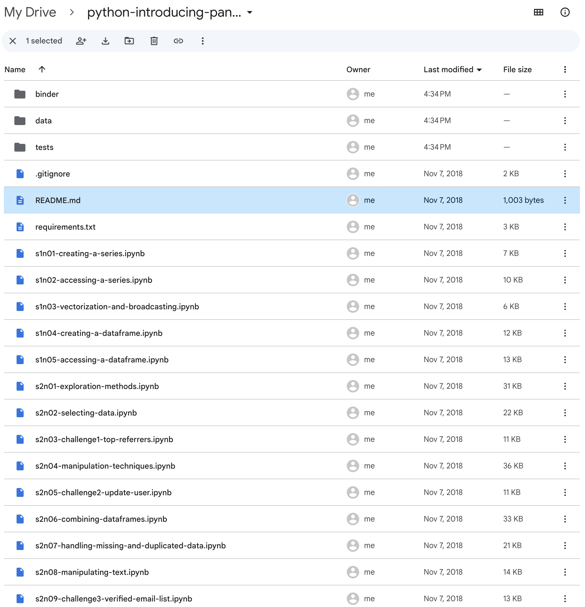

# Setup Colab to Run Treehouse Modules
Walkthrough of setting up Colab to be able to run the Treehouse notebooks

## Download repository file and add to Google Drive
* Go to the [python-introducing-pandas](https://github.com/treehouse-projects/python-introducing-pandas) repository and click the green "Code <>" button

* Select "Download ZIP", then unzip the file on your computer
* Go to your [Google Drive](https://drive.google.com/drive/my-drive) and upload the folder you just unzipped into your main drive
* Double click to go into the folder in Google Drive, and make sure it looks something like this:


## Start working with the files
* Now you're ready to start going through the exercises, each of which is contained in its own Jupyter notebook (files ending in .ipynb)
* Because we're working in a virtual environment when using Colab, each time you open a notebook you'll need to connect it to Google Drive so that it can read the other files contained in the repository. I've gone ahead and written a code block that you can copy and paste in a new code block at the top of each notebook:

```
from google.colab import drive
drive.mount('/content/drive')
%cd drive/MyDrive/python-introducing-pandas-master/
```
* You will be asked to authorize access each time you mount Google Drive to a Colab notebook, but this option means that you're able to save the notebooks in your drive to revisit